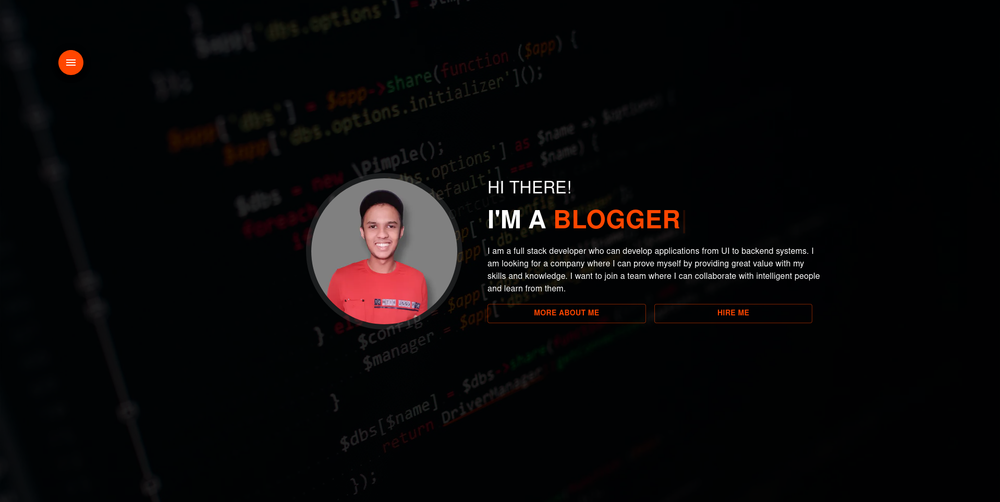
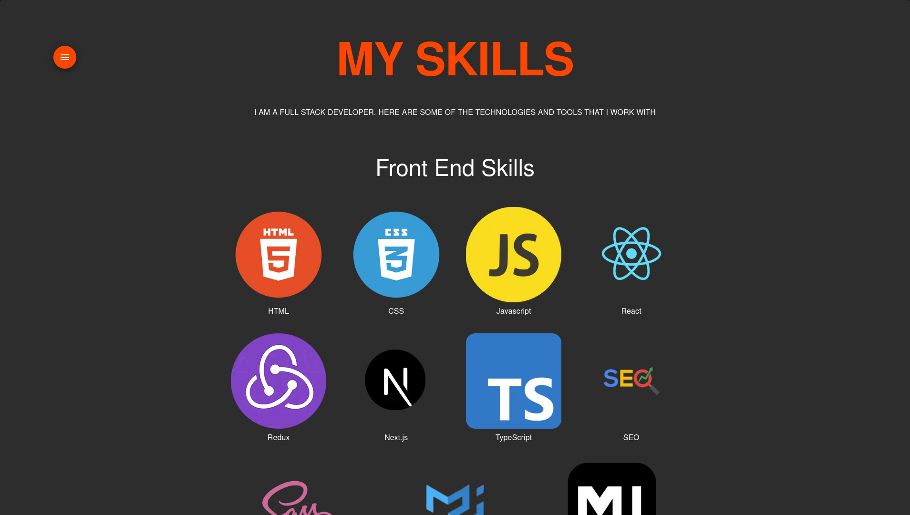

<h1 style="text-align: center;">Portfolio website of Full Stack Developer Anjan</h1>

[Visit my portfolio website](https://www.thatanjan.me/)

### About me

- I can build complex web applications from UI to backend systems to provide great value to your organization.
- I mostly develop MERN(MongoDB, Express, React, NodeJS) stack applications.
- A Self taught Full Stack Developer who is open to learning more and more.

### Screenshots

### My other projects

- [ Confession ](https://github.com/thatanjan/confession)
- [Cules Coding](https://www.culescoding.space/)
- [Cules Shop](https://github.com/thatanjan/cules-shop)

### Contact

I am always open to discussing new opportunities for web development work. If you are looking for a new member for your team, feel free to contact me any time. You can find the information from [ here ](https://www.thatanjan.me/contact).
